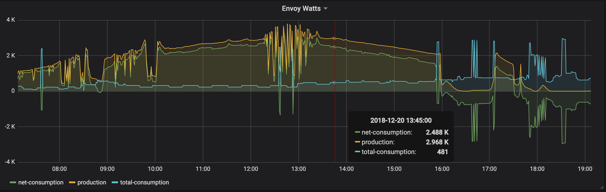
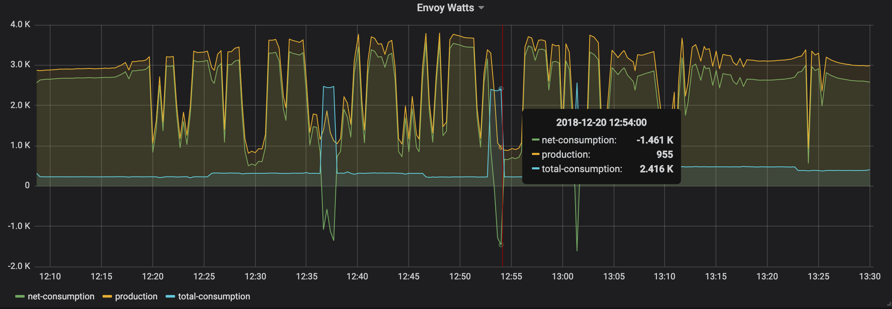
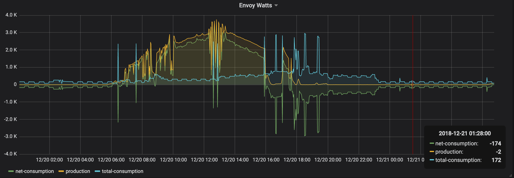
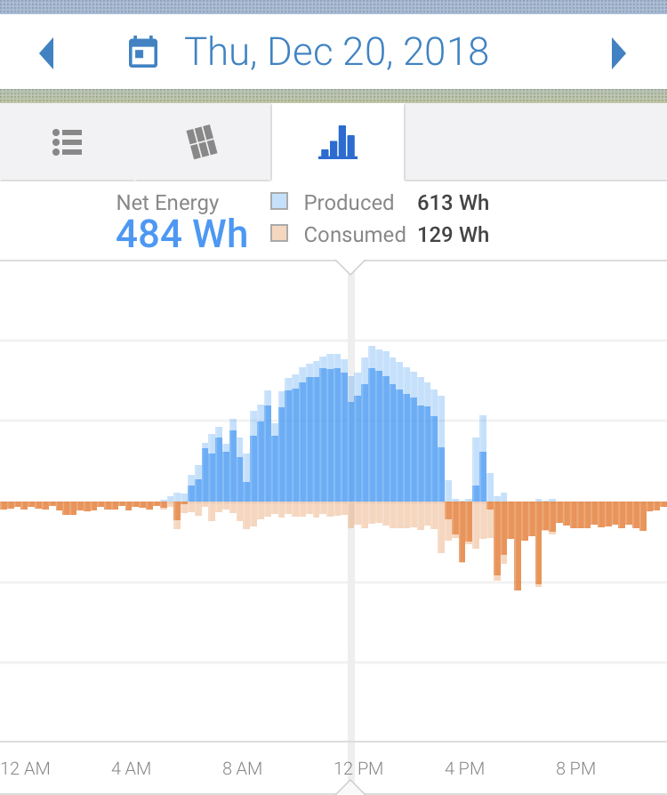

# enphase-envoy-local-monitoring
Utility for finer-grained and locally monitored solar usage with [Enphase Envoy-S](https://enphase.com/en-us/products-and-services/envoy/family) comms gateway to [InfluxDB](https://www.influxdata.com/time-series-platform/) and [Grafana](https://grafana.com/)

This uses the Envoy's local JSON based API directly (which the local monitoring web page uses) - e.g. http://envoy/production.json?details=1.  
As I've only recently started coding in Go, it was a fairly useful excercise in handling a non-trivial structure of arrays and maps.

The current end functionality is not too dissimilar to: https://github.com/fabienroyer/enphase-envoy which scrapes the webpage.

**Note**: there is the official [Enphase Enlighten API](https://developer.enphase.com/docs).  I chose to go local mainly for simplicity, interest, and assumably reactivity.  As per the top of the documentation (as at 2019/01), the official API "does not provide performance data at a panel or microinverter level".  The internal API used does not provide this either.  Additionally, I assume the internal API format currently used could be subject to change without notice.



The finer grained monitoring can allow one to more easily see e.g. when clouds have affected output and the kettle requires consumption from the grid:

or the fidge kicking in pattern at night:


vs MyEnlighten app view:



## Usage
```
./influxEnvoyStats -h
Usage of ./influxEnvoyStats:
  -dba string
    	InfluxDB connection address (default "http://localhost:8086")
  -dbn string
    	Influx database name to put readings in (default "solar")
  -dbp string
    	DB password (default "pw")
  -dbu string
    	DB username (default "user")
  -e string
    	IP or hostname of Envoy (default "envoy")
  -m string
    	Influx measurement name customisation (table name equivalent) (default "readings")
```


## Set-up
I wanted this lightweight monitoring to run on my Raspberry Pi (currently running [Stretch](https://www.raspberrypi.org/downloads/raspbian/)), but is also possible to run on OSX or other Linux.


